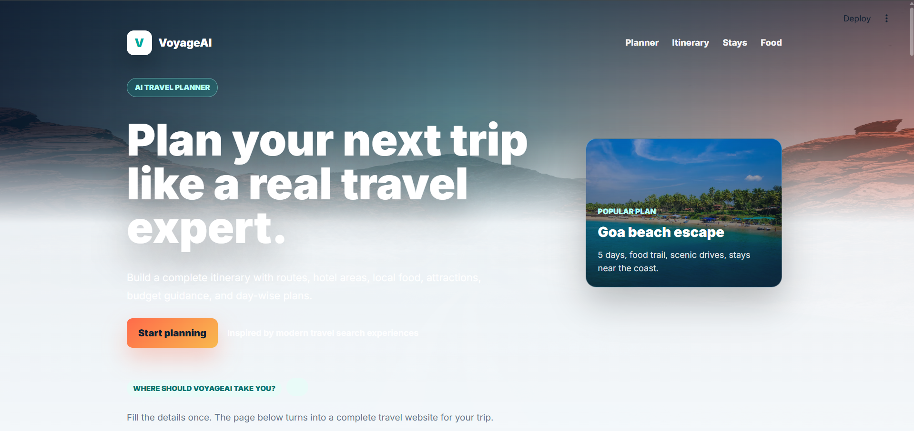
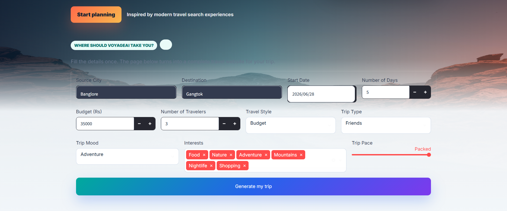
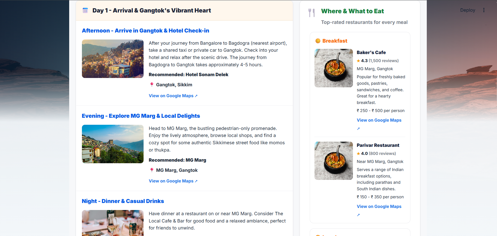
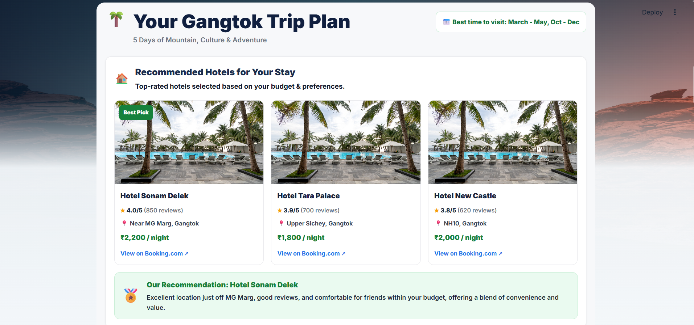
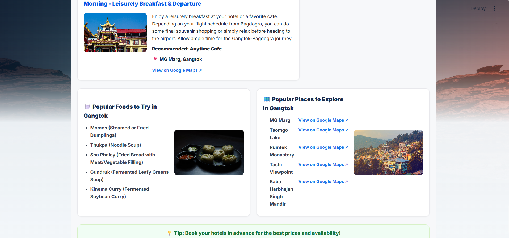

# AI-Powered Travel Planner

An AI-driven travel planning web app built with Streamlit. The app creates personalized itineraries, recommends hotels and attractions, suggests local food, and renders a complete trip report using AI prompt generation and external travel APIs.

## Project Description

This project provides an interactive travel planning experience where users enter a trip origin, destination, dates, budget, travel style, and interests. The app then generates a tailored travel plan by combining:

- AI itinerary generation using Gemini via the `google-genai` client
- Destination insights and recommendations
- Hotel recommendations and trip report rendering
- A responsive Streamlit interface for planning and previewing results

## 📸 Project Screenshots

### 🏠 Home Page



---

### 📝 Travel Planner Form



---

### 🗺️ Generated Itinerary



---

### 🏨 Hotel Recommendations



---

### 📄 Trip Report



## Setup and Usage

1. Clone the repository or open the project folder.
2. Create and activate a virtual environment:

```bash
python -m venv .venv
.venv\Scripts\activate
```

3. Install dependencies:

```bash
pip install -r requirements.txt
```

4. Create a `.env` file in the project root and add your API keys:

```env
GEMINI_API_KEY=your_gemini_api_key
PEXELS_API_KEY=your_pexels_api_key
OPENTRIPMAP_API_KEY=your_opentripmap_api_key
GOOGLE_PLACES_API_KEY=your_google_places_api_key
```

5. Run the Streamlit app:

```bash
streamlit run app.py
```

6. Open the URL shown by Streamlit in your browser.

## Dependencies / Prerequisites

- Python 3.10+ (or a compatible modern Python version)
- Streamlit
- requests
- python-dotenv
- google-genai
- Wikipedia-API

These are installed from `requirements.txt`.

## Solution Approach

The app is structured around a Streamlit frontend and AI/service modules:

- `app.py` defines the user interface, collects trip inputs, and triggers plan generation.
- `config.py` loads API keys from environment variables.
- `ai/itinerary.py` builds an AI prompt and requests itinerary output from Gemini.
- `ai/travel_planner.py` orchestrates travel DNA generation, hotel suggestions, and itinerary building.
- `components/trip_report.py` renders the generated trip plan as a styled HTML report within Streamlit.

The core workflow is:

1. User submits trip details.
2. The app constructs a prompt for AI itinerary generation.
3. Gemini returns structured JSON for itinerary, hotels, and travel recommendations.
4. The app validates and formats the response.
5. The generated trip report is displayed within Streamlit.

## Notes

- Ensure your `.env` file is not committed to version control.
- The app relies on external AI and location APIs, so valid API keys are required.
- The generated itinerary depends on the AI model response format and may need prompt tuning for production use.
